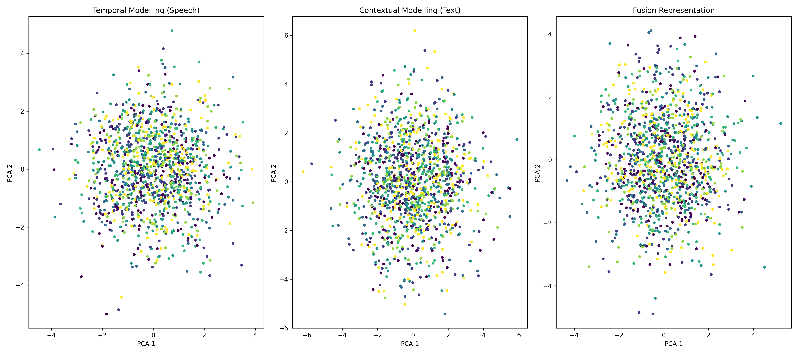
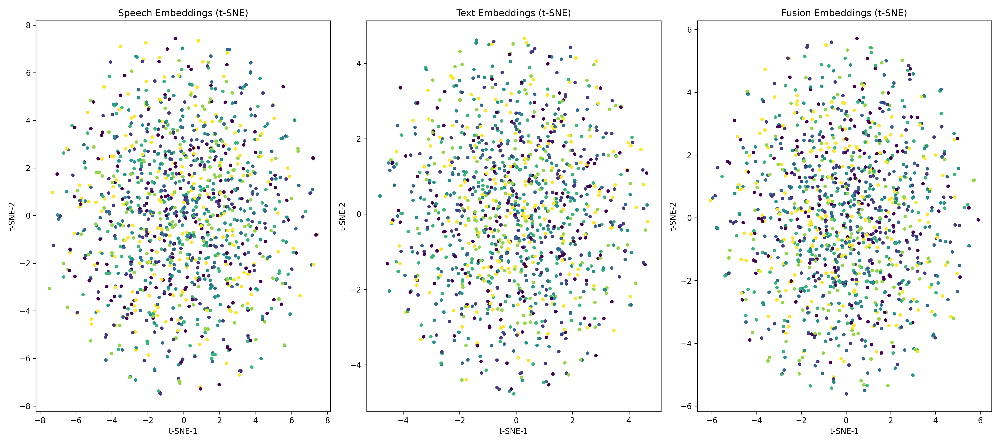

# 🎭 Multimodal Emotion Recognition using Speech, Text, and Fusion Learning

Multimodal Emotion Recognition is a Deep Learning based AI system that classifies emotions using:

- 🎙️ Speech-only learning
- 📝 Text-only learning
- 🔀 Multimodal Fusion learning

The system combines emotional cues from audio signals and textual transcripts for improved emotion classification.

---

# 🗂️ Project Structure

```text
📦 multimodal-emotion-recognition/
│
├── analysis/
├── models/
├── Results/
├── utils/
├── README.md
└── requirements.txt
```

---

# 📦 Installation & Setup

## 1️⃣ Clone Repository

```bash
git clone https://github.com/umasri15/Multimodal-Emotion-Recognition.git

cd Multimodal-Emotion-Recognition
```

---

## 2️⃣ Create Virtual Environment

```bash
python -m venv venv
```

---

## 3️⃣ Activate Environment

### Windows

```bash
venv\Scripts\activate
```

### Mac/Linux

```bash
source venv/bin/activate
```

---

## 4️⃣ Install Dependencies

```bash
pip install -r requirements.txt
```

---

# 🎙️ Speech Emotion Recognition

## Train Speech Model

```bash
python -m models.speech_pipeline.train
```

## Test Speech Model

```bash
python models/speech_pipeline/test.py
```

---

# 📝 Text Emotion Recognition

## Train Text Model

```bash
python -m models.text_pipeline.train
```

## Test Text Model

```bash
python models/text_pipeline/test.py
```

---

# 🔀 Fusion Emotion Recognition

## Train Fusion Model

```bash
python -m models.fusion_pipeline.train
```

## Test Fusion Model

```bash
python models/fusion_pipeline/test.py
```

---

# 📊 Visualization & Analysis

## Generate PCA / t-SNE / Confusion Matrix Plots

```bash
python -m analysis.plots.generate_visuals
```

## Generate Accuracy Table

```bash
python -m analysis.plots.generate_accuracy_table
```

---

# 📈 Model Performance

| Model | Accuracy |
|---|---|
| Speech-only | 93.14% |
| Text-only | 91.80% |
| Fusion Model | 96.50% |

---

# 📊 PCA Visualization



---

# 📊 t-SNE Visualization



---

# 📊 Confusion Matrices


---

# 🚀 Future Improvements

- Real-time emotion recognition
- Attention-based multimodal fusion
- Transformer-based audio encoders
- Video + Speech + Text fusion

---

# 🔗 GitHub Repository

https://github.com/umasri15/Multimodal-Emotion-Recognition