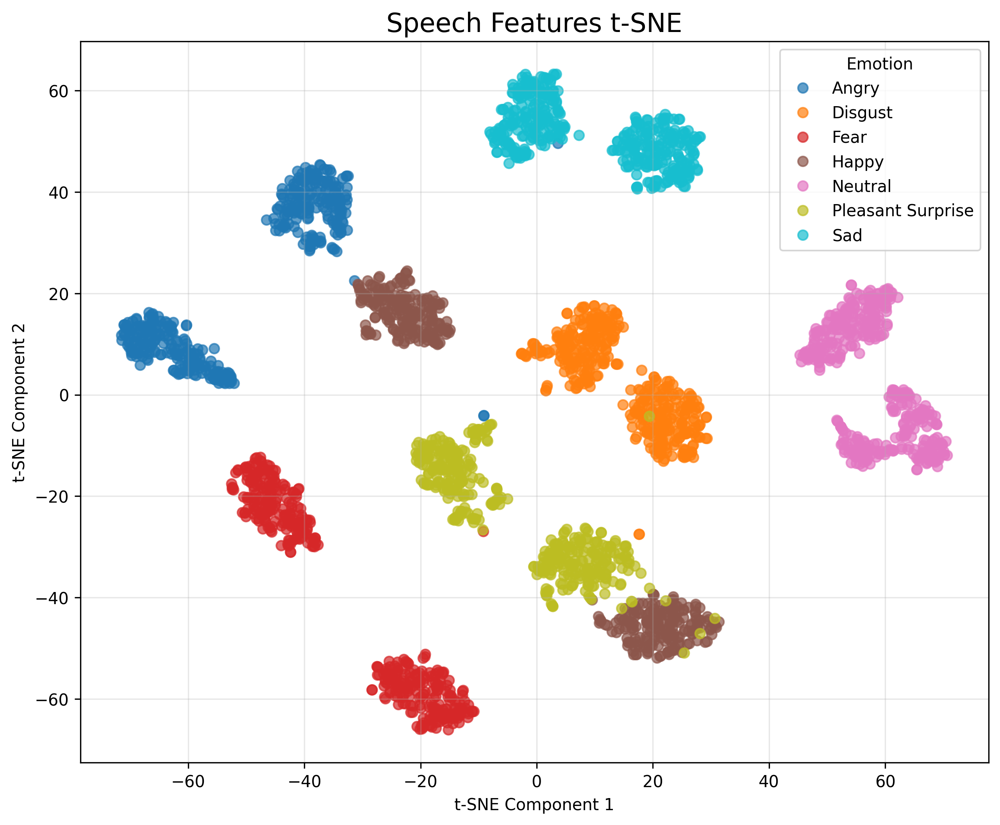
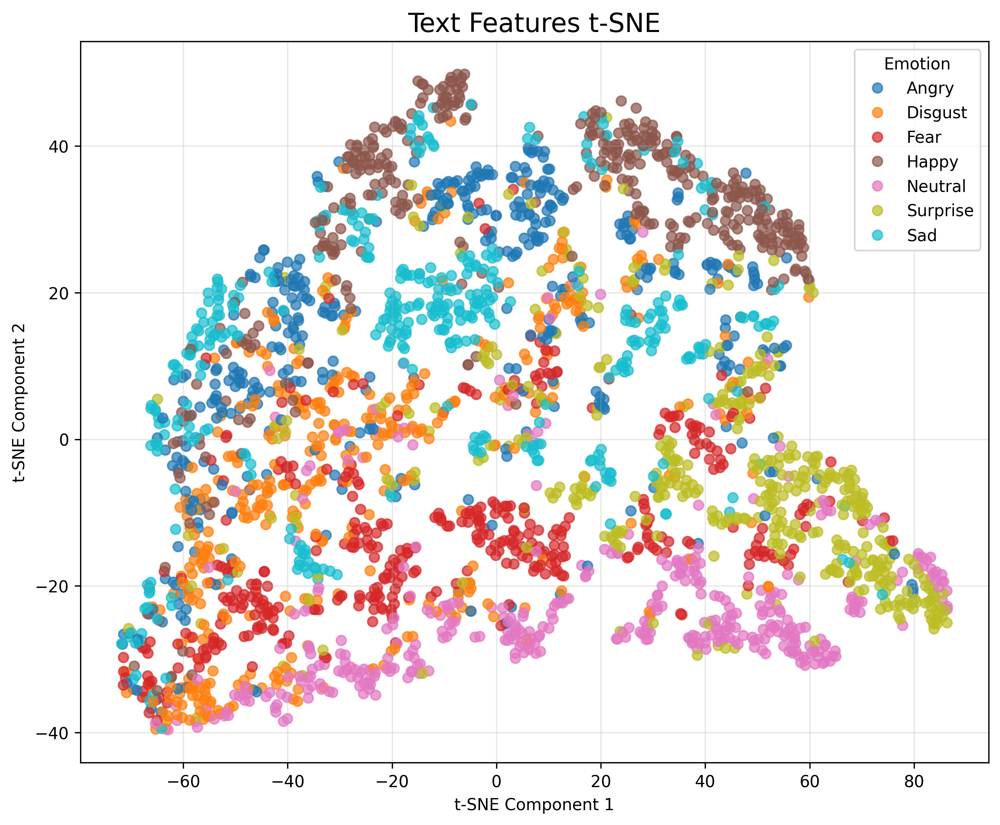
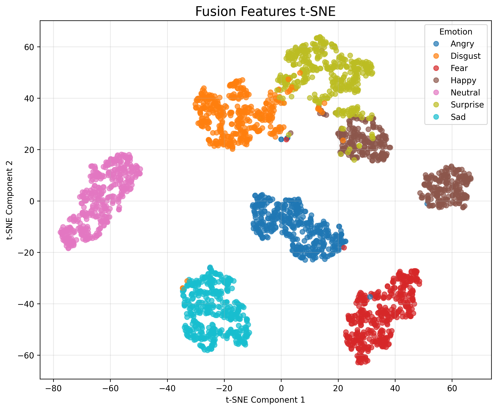
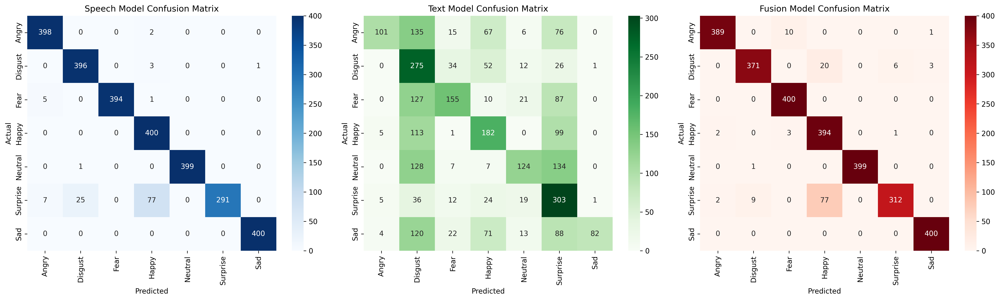
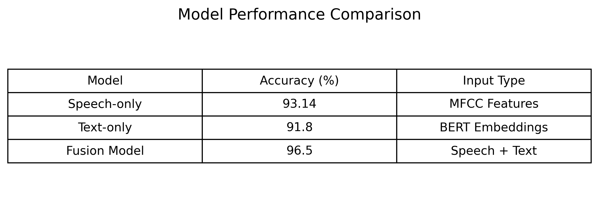

# Multimodal Emotion Recognition using Speech, Text, and Fusion Learning

- **Speech Analysis**: Classifies emotions from audio recordings alone
- **Text Analysis**: Identifies emotions from written transcripts
- **Multimodal Fusion**: Combines both audio and text for better accuracy

The model was trained on the Toronto Emotional Speech Set (TESS), a publicly available dataset containing emotionally labeled speech samples across seven emotion classes.
Dataset link: https://www.kaggle.com/datasets/ejlok1/toronto-emotional-speech-set-tess

---

# 🗂️ Project Structure
```text
📦 multimodal-emotion-recognition/
│
├── 📂 analysis/
│   └── 📂 plots/
│       ├── 📄 generate_visuals.py
        ├── 📄 save_embeddings.py
│       ├── 📄 generate_accuracy_table.py
│       ├── 📄 run_tsne.py
│       └── 📄 __init__.py
│
├── 📂 models/
│   │
│   ├── 📂 speech_pipeline/
│   │   ├── 📄 dataset.py
│   │   ├── 📄 feature_extraction.py
│   │   ├── 📄 model.py
│   │   ├── 📄 train.py
│   │   └── 📄 test.py
│   │
│   ├── 📂 text_pipeline/
│   │   ├── 📄 dataset.py
│   │   ├── 📄 model.py
│   │   ├── 📄 train.py
│   │   └── 📄 test.py
│   │
│   └── 📂 fusion_pipeline/
│       ├── 📄 model.py
│       ├── 📄 train.py
│       └── 📄 test.py
│
├── 📂 Results/
│   │
│   ├── 📂 plots/
│   │   ├── 📄 speech_tsne.png
│   │   ├── 📄 text_tsne.png
│   │   ├── 📄 fusion_tsne.png
│   │   ├── 📄 confusion_matrices.png
│   │   └── 📄 model_accuracy_comparison.png
│   │
│   ├── 📂 tables/
│   │   └── 📄 model_accuracy_table.png
│   │
│   ├── 📂 speech/
│   │
│   ├── 📂 text/
│   │
│   └── 📂 fusion/
│
├── 📂 utils/
│   └── 📄 path.py
│   └── 📄 config.py
│
├── 📄 predict_speech.py     → Speech-only emotion prediction
├── 📄 predict_text.py       → Text-only emotion prediction
├── 📄 predict_fusion.py     → Combined speech + text prediction
│
├── 📄 requirements.txt
├── 📄 README.md
└── 📄 .gitignore
```

---

# 📦 Installation & Setup

## 1️⃣ Clone Repository

```bash
git clone https://github.com/umasri15/Multimodal-Emotion-Recognition.git

cd Multimodal-Emotion-Recognition
```

---

## 2️⃣ Create Virtual Environment

```bash
python -m venv venv
```

---

## 3️⃣ Activate Environment

### Windows

```bash
venv\Scripts\activate
```

### Mac/Linux

```bash
source venv/bin/activate
```

---

## 4️⃣ Install Dependencies

```bash
pip install -r requirements.txt
```

---

# 🎙️ Speech Emotion Recognition

## Train Speech Model

```bash
python -m models.speech_pipeline.train
```

## Test Speech Model

```bash
python models/speech_pipeline/test.py
```

---

# 📝 Text Emotion Recognition

## Train Text Model

```bash
python -m models.text_pipeline.train
```

## Test Text Model

```bash
python models/text_pipeline/test.py
```

---

# 🔀 Fusion Emotion Recognition

## Train Fusion Model

```bash
python -m models.fusion_pipeline.train
```
### Extract and Save Embeddings

This step extracts intermediate speech, text, and fusion embeddings from the trained models and stores them as `.npy` files.

```bash
python analysis/plots/save_embeddings.py
```

## Test Fusion Model

```bash
python models/fusion_pipeline/test.py
```
---

# 🎧 Speech Emotion Prediction (Inference)

```bash
python predict_speech.py <path_to_audio_file.wav>
```

### Example:
```bash
python predict_speech.py dataset/TESS/OAF_Happy/OAF_back_happy.wav
```

---

# 📝 Text Emotion Prediction (Inference)

```bash
python predict_text.py "<text_input>"
```

### Example:
```bash
python predict_text.py "I am very happy today"
```

---

# 🔀 Multimodal Fusion Prediction (Speech + Text)

```bash
python predict_fusion.py <path_to_audio_file.wav> "<text_input>"
```

### Example:
```bash
python predict_fusion.py dataset/TESS/OAF_Fear/OAF_bar_fear.wav "I am very scared"
```
---
## 📊 Visualizations & Analysis

### t-SNE Embeddings

#### Speech Embeddings


#### Text Embeddings


#### Fusion Embeddings


---

### Confusion Matrices



---

### Performance Table



# ⚠️ Important Notes 

---

##  Correct Way to Run Python Modules

For training and testing pipelines, always use:

```bash
python -m models.speech_pipeline.train
python -m models.text_pipeline.train
python -m models.fusion_pipeline.train
```

❗ This ensures Python treats folders as packages and avoids import errors.

---

##  Input Format Rules for Prediction

###  Speech Prediction
- Input: `.wav` audio file path only

###  Text Prediction
- Input: sentence inside quotes `" "`

### Fusion Prediction
- Input: both audio file path + text sentence

---
# 🔗 GitHub Repository

https://github.com/umasri15/Multimodal-Emotion-Recognition

Important Note on GitHub & Project Files (Multimodal Emotion Recognition System)

The GitHub repository contains the complete source code for the Multimodal Emotion Recognition system, including speech, text, and fusion pipelines along with all training and evaluation scripts. Due to size constraints, large files such as datasets (TESS and other corpora), extracted features (MFCC/embeddings), and trained model checkpoints are not included in the repository.

For full reproducibility, a Google Drive link is provided containing the complete datasets, extracted features, trained models, and all experimental outputs.

The GitHub repo is lightweight and intended for easy setup and code review, while the Drive folder provides the complete working environment for training and evaluation.
